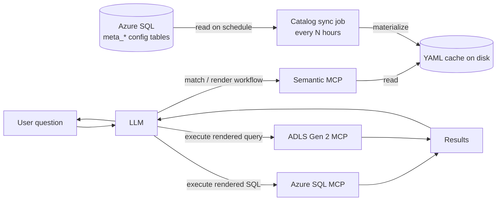
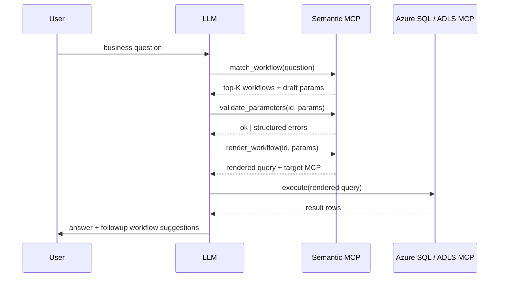

# Semantic Layer Plan

A design document for a third "Semantic MCP" server that sits beside the existing Azure SQL and ADLS Gen 2 MCPs. The semantic catalog (34 tables, joins, statuses, metrics, workflows) is owned in a set of configuration tables in Azure SQL and materialized to a local YAML cache by a sync job every few hours. The MCP exposes tools that steer the LLM into a workflow-selection + parameter-fill flow instead of free-form NL→SQL.

## 1. Problem framing

- Two working MCP servers exist (Azure SQL, ADLS Gen 2). They answer well-scoped prompts but require iterative refinement on broader business questions.
- Business team's day-to-day need is data pulls across **34 tables** involving joins, statuses, and date ranges — not exploratory SQL.
- Goal: cut iteration cost by giving the LLM a **semantic layer** + a **workflow library** so it can reliably select a canonical query and fill parameters, instead of authoring SQL from scratch.
- Explicit non-goals (Phase 1): full agentic planning, open-ended NL→SQL, write operations, dashboard authoring.

## 2. Architecture recommendation

Add a **third MCP server: Semantic MCP**, peer to the existing two. Trade-offs considered:

- Extend existing MCPs — mixes raw execution with semantics; semantics span both systems, so catalog logic would be duplicated. Rejected.
- Orchestrator MCP that internally calls the other two as MCP clients — extra hop, hides raw access the team already relies on. Rejected for Phase 1.
- **New peer Semantic MCP (chosen)** — owns catalog + workflows + a render/validate kernel. It returns rendered queries plus a hint of which existing MCP should execute them; the LLM dispatches. Keeps the two existing MCPs untouched and lets the catalog evolve independently. A future Phase can let Semantic MCP execute directly if dispatch hops become a bottleneck.



## 3. Semantic catalog

**Source of truth: configuration tables in Azure SQL.** A sync job runs on a schedule (default every 4 hours, configurable) and materializes the catalog into a local YAML cache that the Semantic MCP reads from. The MCP never queries the config tables on the hot path. This keeps reads fast, allows the catalog to be edited by data/business owners through familiar SQL tooling (or a thin internal UI later), and gives an inspectable, versionable snapshot for debugging.

### 3.0 Source-of-truth config tables (Azure SQL)

Schema name suggestion: `semantic`. All tables are owner-managed and audited.

- `semantic.meta_tables` — `table_id (PK)`, `physical_kind` (`azure_sql`|`adls_delta`), `physical_ref`, `description`, `grain`, `primary_key_json`, `natural_key_json`, `default_filters_json`, `owner`, `last_reviewed`, `is_active`, `updated_at`, `updated_by`.
- `semantic.meta_columns` — `column_id (PK)`, `table_id (FK)`, `name`, `data_type`, `business_meaning`, `allowed_values_json`, `nullability_notes`, `pitfalls`, `is_active`.
- `semantic.meta_joins` — `join_id (PK)`, `name`, `left_table_id`, `right_table_id`, `on_json` (list of column pairs), `cardinality`, `is_canonical`, `notes`.
- `semantic.meta_metrics` — `metric_id (PK)`, `name`, `business_definition`, `expression`, `grain`, `compatible_dimensions_json`, `owner`.
- `semantic.meta_workflows` — `workflow_id (PK)`, `name`, `description`, `target_mcp`, `query_template` (TEXT), `default_filters_json`, `joins_used_json`, `output_columns_json`, `followups_json`, `is_active`, `owner`, `updated_at`.
- `semantic.meta_workflow_parameters` — `param_id (PK)`, `workflow_id (FK)`, `name`, `type`, `enum_ref`, `required`, `default_value`, `rule`, `prompt_hint`, `position`.
- `semantic.meta_workflow_examples` — `example_id (PK)`, `workflow_id (FK)`, `question_text`, `expected_parameters_json`.
- `semantic.meta_glossary_terms` — `term_id (PK)`, `term`, `kind` (`status`|`date`|`business_term`), `payload_json`, `resolves_to`.
- `semantic.meta_catalog_version` — single row updated by writers on commit: `version_id`, `bumped_at`, `bumped_by`, `notes`. The sync job uses this as a cheap change-detection signal.

Edits should land via a stored procedure or a small change-set table that bumps `meta_catalog_version` atomically — never via ad-hoc UPDATEs that skip the version bump.

### 3.0.1 Sync job

- Runs on a schedule (default every 4 hours; cadence configurable per environment).
- Steps: open a read transaction → snapshot all `meta_*` tables → run validators (see §6) → write the new YAML tree to a staging directory → atomically rename to the active cache directory.
- Skips materialization when `meta_catalog_version` is unchanged since the last successful run.
- On validation failure: keeps the previous good cache, emits an alert, leaves an annotated diff in the staging directory for review.
- Exposes a `refresh_catalog(force?: bool)` admin tool on the Semantic MCP for on-demand refresh after edits, gated by an env-level admin flag.
- Where it runs: scheduled task colocated with the Semantic MCP (simplest), or external scheduler (cron / Azure Function / GitHub Action) that writes the cache to a shared volume. Recommendation: colocated for Phase 2, decouple later if multiple MCP replicas are introduced.

### 3.0.2 Materialized YAML cache (read path)

The cache lives on disk in the same shape as before — the LLM-facing semantics do not change; only the source does.

```
semantic_cache/
  tables/        # one file per table (34 files)
  joins/         # canonical relationship graph
  metrics/       # business measures (revenue, active customers, ...)
  workflows/     # parameterized canonical queries (the heart of the system)
  glossary/      # enums, statuses, fiscal calendar, business terms
  _meta.yaml     # catalog_version, materialized_at, source_row_counts
```

Sections 3.1–3.5 below describe the **logical shape** of each catalog entity; the same shape appears as columns in `meta_*` config tables and as files in the YAML cache.

### 3.1 Table entry (logical shape; cached as `tables/<table>.yaml`)

- `physical`: `{ kind: azure_sql | adls_delta, ref: <schema.table | abfss://...> }`
- `description`: 1-2 sentence business meaning
- `grain`: "one row per …"
- `primary_key`, `natural_key`
- `columns[]`: `name`, `type`, `business_meaning`, `allowed_values` (for enums), `nullability_notes`, `pitfalls` (e.g. `is_active=0 means soft-deleted`)
- `default_filters`: filters that should almost always be applied (active-only, current fiscal year, etc.)
- `owner`, `last_reviewed`

### 3.2 Join entry (logical shape; cached as `joins/canonical.yaml`)

A registry of named, blessed join paths so workflows never invent their own joins.

- `name`: human phrase (e.g. `"orders ↔ customers"`)
- `left`, `right`, `on: [(left_col, right_col), ...]`
- `cardinality`: one-to-many | many-to-many | one-to-one
- `canonical: true|false` (preferred path vs. acceptable alternative)
- `notes`: any gotchas (deleted-row filtering, type coercions)

### 3.3 Metric entry (logical shape; cached as `metrics/<metric>.yaml`)

- `name`, `business_definition`
- `expression`: e.g. `sum(orders.total_amount) where orders.status in ('shipped','delivered')`
- `grain`: daily | weekly | monthly
- `compatible_dimensions`: which dimensions it can be sliced by

### 3.4 Glossary entries (logical shape; cached under `glossary/`)

- `statuses.yaml` — every status enum across the 34 tables with business meanings
- `dates.yaml` — fiscal vs calendar definitions, common ranges (`last_week`, `mtd`, `qtd`, `ytd`)
- `terms.yaml` — business term → catalog entry mapping (e.g. `"churned customer" → metric:churn_customers`)

### 3.5 Workflow entry (logical shape; cached as `workflows/<id>.yaml`) — the core artifact

```yaml
id: orders_by_status_in_range
name: Orders by status within a date range
description: Returns orders filtered by status and order date, optionally grouped by customer or region.
example_questions:
  - "How many orders shipped last week?"
  - "Show cancelled orders in March by region"
  - "Total order value for status='delivered' MTD"
parameters:
  - { name: status, type: enum, ref: glossary.statuses.orders, required: true }
  - { name: start_date, type: date, required: true }
  - { name: end_date, type: date, required: true, rule: "must be >= start_date" }
  - { name: group_by, type: enum, values: [customer, region, none], default: none }
joins_used: [orders↔customers, customers↔regions]
default_filters: [orders.is_active=1]
target: { mcp: azure_sql }
query_template: |
  SELECT {{ group_dim_sql }} , COUNT(*) AS order_count, SUM(o.total_amount) AS total_value
  FROM orders o
  {{ join_sql }}
  WHERE o.status = :status
    AND o.order_date BETWEEN :start_date AND :end_date
    AND o.is_active = 1
  GROUP BY {{ group_dim_sql }}
output_columns:
  - { name: order_count, meaning: "Number of distinct orders" }
  - { name: total_value, meaning: "Sum of order totals in account currency" }
followups:
  - drilldown_orders_for_customer
  - reconcile_orders_sql_vs_lake
```

Workflows are the LLM's main affordance. They convert "free-form question over 34 tables" into "pick one of N named workflows + extract parameters".

## 4. Semantic MCP tool surface

Deliberately small and workflow-shaped (no `text_to_sql`):

- `list_workflows(filter?)` — paginated, with one-line descriptions.
- `describe_workflow(id)` — full spec including parameter rules and example questions.
- `match_workflow(question)` — embedding-based ranker over workflow descriptions + example questions; returns top-K with confidence and best-guess parameters parsed from the question.
- `render_workflow(id, parameters)` — returns `{ rendered_query, target_mcp, target_tool_call, output_schema, postprocessing_hints }`. The LLM then calls the appropriate existing MCP with `target_tool_call`.
- `validate_parameters(id, parameters)` — runs declarative rules (enum membership, date ordering, required fields) and returns a structured error list so the LLM can self-correct without a round-trip to the user.
- `describe_table(name)`, `describe_column(table, column)`, `describe_metric(name)` — atomic catalog lookups.
- `lookup_glossary(term)` — business term resolution.
- `propose_parameters(workflow_id, question)` — optional helper that extracts dates/statuses/IDs from a natural question into a parameter dict, kept narrow and per-workflow.
- `catalog_status()` — returns `catalog_version`, `materialized_at`, source row counts, last sync result. Useful both for the LLM (to disclose freshness when answering) and for ops.
- `refresh_catalog(force?: bool)` — admin-gated; triggers an immediate sync. Used after a config-table edit when you don't want to wait for the next scheduled run.

The LLM's typical loop becomes:



## 5. Workflow library seeding (first 10–15)

Pick from the team's actual recurring asks. Indicative seeds — to be confirmed with the business team:

- `entity_lookup_by_id` — pull a row + canonical joined context for an order / customer / asset.
- `entity_timeline` — status changes for an entity over a date range.
- `count_by_status_in_range` — generic count grouped by status.
- `sum_metric_in_range` — sum a registered metric over a date window with optional group-by.
- `top_n_by_metric` — top-N customers/regions/products by a metric for a period.
- `cohort_snapshot` — entities matching a status-and-date filter at a point in time.
- `period_over_period` — same metric this period vs prior, with delta.
- `recon_sql_vs_lake` — count and sum comparison for a given table across both systems.
- `freshness_check` — last-loaded timestamp for a table or feed.
- `value_distribution` — frequency of values for a column (sanity check).

Each is inserted as one row (plus parameter / example child rows) into the `meta_workflows` family and validated against the rest of the catalog before being materialized into the cache.

## 6. Validation and governance

The same validators run in two places: (a) optionally pre-commit / pre-merge if catalog edits are reviewed via a thin tool, and (b) **always inside the sync job** before swapping the cache. A failed sync leaves the previous good cache active.

- **Catalog linter**: every `meta_joins.on_json` references real columns in `meta_columns`; every workflow's `joins_used_json` references existing join rows; every metric `expression` references real columns; every glossary `resolves_to` resolves.
- **Schema-drift check**: linter compares `meta_columns` against live `INFORMATION_SCHEMA` (Azure SQL) and ADLS Delta table manifests; mismatches block materialization and emit an alert.
- **Workflow tests**: each workflow's `meta_workflow_examples` rows are the test set; a harness asserts `match_workflow` ranks the right workflow top-1 and `propose_parameters` returns the expected params. Runs on every sync against the freshly materialized cache.
- **Telemetry** (Phase 4): log `(question, matched_workflow, confidence, catalog_version, executed?, user_followup?)` to a local table for offline review of misses and to prioritize new workflows.
- **Ownership and audit**: every `meta_*` row carries `owner`, `updated_at`, `updated_by`. Optional `meta_*_history` shadow tables (or temporal tables) capture full edit history. Stale entries (`last_reviewed` older than N months) flagged in `catalog_status()` output.

## 7. Phased rollout

- **Phase 1 — Catalog foundation (week 1–2)**
  - Inventory the 34 tables: grain, PKs, FKs.
  - Define logical schemas (jsonschema files) for table / join / metric / workflow / glossary entities — these double as the YAML cache schema and the JSON-column schemas in the config tables.
  - Create the `semantic.meta_*` config tables in Azure SQL (DDL + write-side stored procedures that bump `meta_catalog_version`).
  - Seed `meta_tables` and `meta_joins` for all 34 tables via a one-off load script.

- **Phase 2 — Sync job + Semantic MCP MVP (week 3–4)**
  - Implement the sync job (scheduled materialization, atomic cache swap, validation gate, change-detection via `meta_catalog_version`).
  - Implement read-path tools: `list_workflows`, `describe_workflow`, `describe_table`, `describe_column`, `describe_metric`, `lookup_glossary`, `render_workflow`, `validate_parameters`, `catalog_status`, `refresh_catalog`.
  - Seed 5 workflows covering the most common asks.
  - Manual end-to-end smoke test through the LLM, including a forced refresh after a config-table edit.

- **Phase 3 — Matcher + parameter extraction (week 5–6)**
  - Implement `match_workflow` using embeddings over `description + example_questions`. Start with a single embedding model and cosine similarity; no vector DB needed for ~50 workflows. Embeddings are recomputed at sync time when `meta_catalog_version` bumps and stored alongside the cache.
  - Implement `propose_parameters` per-workflow (status enums, date phrase parsing).
  - Offline eval set of 50–100 real business questions; tune until top-1 match rate is acceptable.

- **Phase 4 — Quality loop (week 7+)**
  - Telemetry on workflow matches and misses (includes `catalog_version` per call).
  - Weekly review: promote frequent "no match" questions into new workflow rows.
  - Expand the library to 20–30 workflows.

- **Phase 5 — Optional**
  - Direct execution from Semantic MCP if dispatch hops hurt UX.
  - Thin internal UI for editing `meta_*` rows (replacing raw SQL edits) if the business team wants self-service.
  - Add lightweight result caching with parameter-hash keys for the slowest workflows.
  - Move from polling-based sync to push (DB trigger / Service Bus message) if a few-hours cadence is too slow.

## 8. Risks and mitigations

- **Workflow library bloat** — strict ownership + telemetry-driven pruning; merge near-duplicates.
- **Stale catalog vs. schema drift** — sync-time linter runs against live `INFORMATION_SCHEMA` and ADLS table manifests; mismatches block materialization.
- **Stale cache during outages** — `catalog_status()` exposes `materialized_at`; if it's older than 2× the configured cadence, the MCP surfaces a warning in every tool response so the LLM can disclose freshness.
- **Partial / inconsistent edits in config tables** — all writes go through stored procedures that bump `meta_catalog_version` atomically; sync only swaps the cache after full validation.
- **Sync job failure** — keep last good cache active, alert on failed runs, expose admin `refresh_catalog(force=true)` for manual re-runs after fixes.
- **Hot edits needed faster than cadence** — admins call `refresh_catalog` after committing changes; future phase can switch to push-based invalidation.
- **Over-fitting matcher to seed questions** — eval set must come from real chat logs, not authored examples.
- **Ambiguous workflow match** — when top-K confidences are close, return all of them and let the LLM ask a single disambiguation question, rather than guessing.
- **Parameter hallucination** — `validate_parameters` is the firewall; nothing executes without passing it.

## 9. Open questions to resolve before Phase 1

- Which 5 workflows seed the library? Pull from last 30–60 days of business asks.
- Default sync cadence: 4 hours is a reasonable starting point — confirm or adjust per environment.
- Editing UX for `meta_*` tables: raw SQL / a notebook / a small internal form? Raw SQL is fine for Phase 1; revisit in Phase 5.
- Should the sync job live with the Semantic MCP process, or be an external scheduled task (Azure Function / cron) writing to a shared volume?
- Hosting: same repo as the two existing MCPs, or its own repo?
- Auth model: Semantic MCP now needs a read-only Azure SQL credential scoped to `semantic.meta_*` and `INFORMATION_SCHEMA`. The existing MCPs continue to hold the credentials used for actual query execution.
- Should `render_workflow` also produce a polars/duckdb plan for ADLS Delta workflows, or just SQL strings that the ADLS MCP knows how to run?
